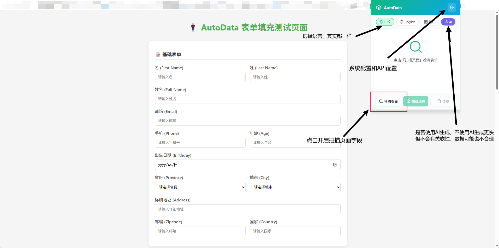
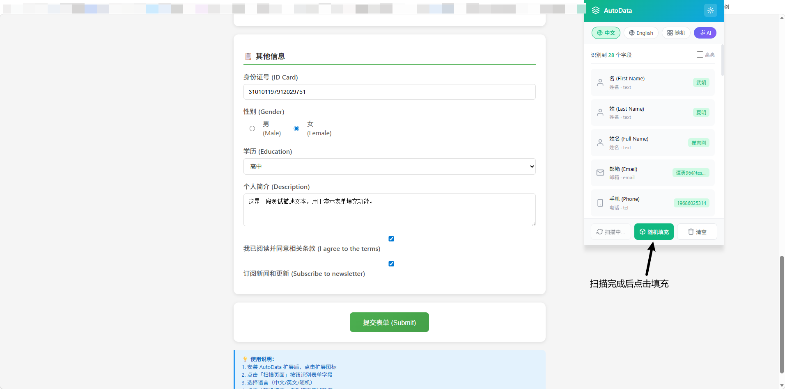
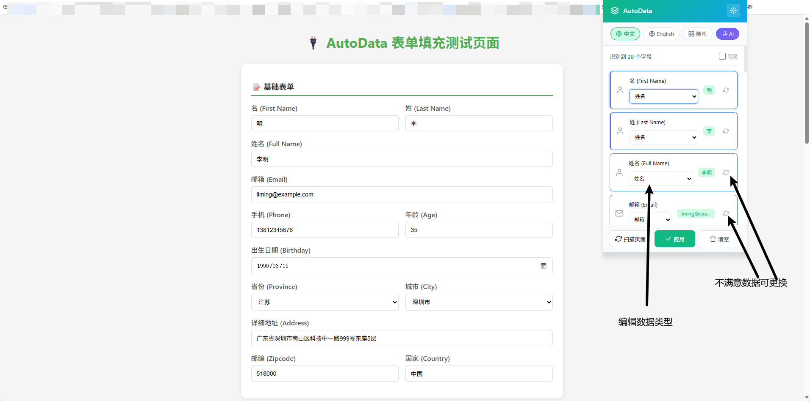

# AutoData - 表单自动填充扩展

一款浏览器扩展（Manifest V3），自动识别网页表单字段并填充测试数据。支持中英文数据、AI智能推断、关联字段一致性生成。

## 功能特性

### 智能字段识别
- 自动扫描页面表单元素（input、select、textarea、contenteditable）
- 支持多种 UI 框架：Vant、Ant Design、Element UI、iView
- 支持字段类型：姓名、邮箱、手机、地址、身份证、银行卡、密码、日期等 30+ 种

### AI 增强分析
- 调用 Anthropic Claude / OpenAI GPT 进行字段类型推断
- **关联一致性生成**：姓名↔性别↔身份证↔生日、地址链、银行链等数据自动保持一致
- 支持自定义 AI 服务地址（可对接代理/私有部署）

### 本地数据生成
- 纯 JavaScript 实现，无需外部依赖
- 支持中英文双语数据
- 支持自定义字段映射规则

## 安装使用

### 安装扩展

```bash
# 构建扩展
cd autodata-extension
npm install
npm run build
```

然后在浏览器中加载：

**Edge/Chrome**：
1. 打开 `edge://extensions` 或 `chrome://extensions`
2. 开启「开发者模式」
3. 点击「加载解压缩的扩展」
4. 选择 `dist/` 文件夹

### 配置 AI（可选）

1. 点击扩展图标打开 popup
2. 进入设置面板
3. 启用 AI 分析
4. 选择提供商（Anthropic / OpenAI）
5. 填入 API 地址和密钥
PS:建议使用DeepSeek-v4系列模型，输出稳定性更好。如果AI扫描输出结果不好可以多重试几次。

### 使用方式

1. **扫描页面**：点击「扫描页面」按钮，自动识别表单字段
2. **选择语言**：选择「中文」「英文」或「随机」
3. **一键填充**：点击「填充」，自动填写所有字段
4. **编辑修改**：填充后可编辑字段类型，重新生成单个字段

## 界面预览







当表单包含关联字段时，AI 会识别并保持数据一致：

| 关联组 | 一致性规则 |
|--------|-----------|
| 身份信息 | 姓名 = 姓 + 名；性别与身份证17位奇偶一致；生日与身份证7-14位一致；年龄与出生年份一致 |
| 地址链 | 省份 → 城市 → 区县 → 详细地址 → 邮编 层级对应 |
| 银行链 | 开户区域 → 银行名称 → 支行名称 对应；银行卡号 BIN 与银行匹配 |
| 联系方式 | 邮箱前缀与姓名关联 |

## 项目结构

```
autodata-extension/
├── background/
│   └── service-worker.js    # AI 调用 + 配置管理
├── content/
│   ├── content-script.js     # 消息中枢
│   ├── detectors/           # 表单检测
│   └── fillers/             # 填充实现
├── data/
│   ├── faker-data.js        # 数据生成器
│   └── field-mappings.js    # 字段映射规则
├── popup/                    # 扩展弹窗 UI
├── build.js                  # 构建脚本
└── manifest.json
```

## 开发

```bash
# 安装依赖
npm install

# 构建
npm run build

# 构建产物在 dist/ 目录
```

## License

MIT
